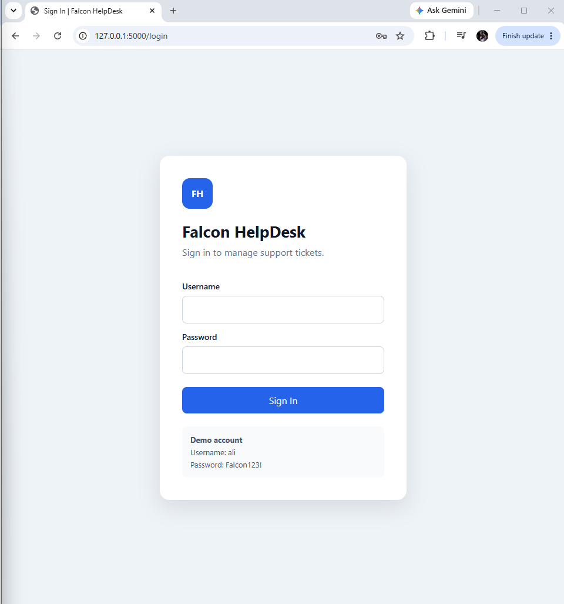
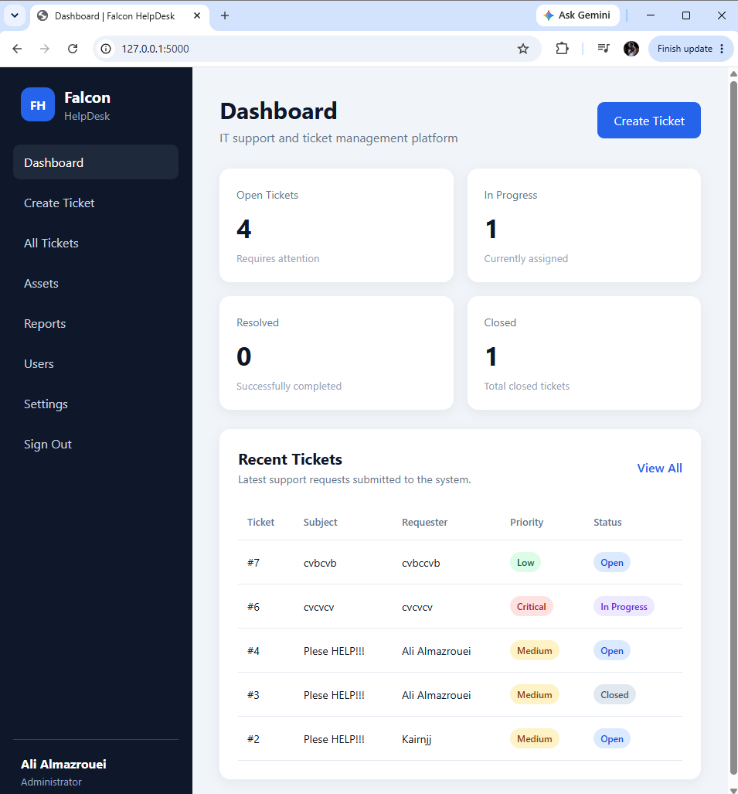
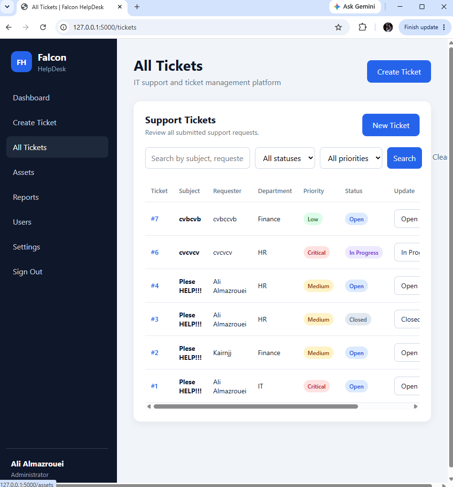
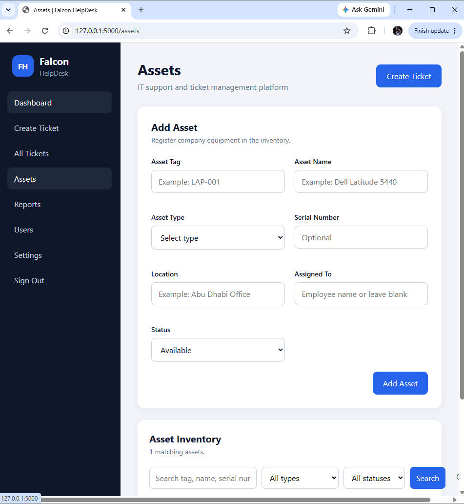
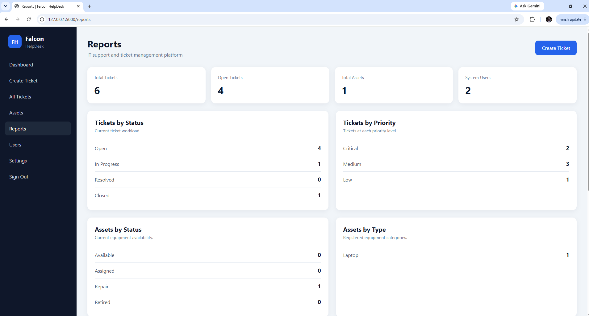

# Falcon HelpDesk

Falcon HelpDesk is an IT support and ticket management web application that I built using Python, Flask, SQLite, HTML, and CSS.

I created this project to practice web development, databases, login systems, user roles, and IT support workflows.

## Features

- Login and logout system
- Password hashing
- Administrator, Technician, and User roles
- Create and view support tickets
- Edit and delete tickets
- Update ticket status
- Search and filter tickets
- Asset inventory management
- Search and edit assets
- User account management
- Dashboard statistics
- Reports for tickets, assets, and users

## User Roles

### Administrator

The Administrator has full access to tickets, assets, reports, and user accounts.

### Technician

The Technician can manage tickets, update ticket status, manage assets, and view reports.

### User

The User can create tickets, view tickets, and view the dashboard.

## Technologies Used

- Python
- Flask
- SQLite
- HTML
- CSS
- Jinja
- Werkzeug
- Git
- GitHub

## Screenshots

### Login Page



### Dashboard



### Tickets



### Assets



### Reports



## How to Run the Project

First, clone the repository:

```powershell
git clone https://github.com/Alialmaz8/falcon-helpdesk.git
cd falcon-helpdesk